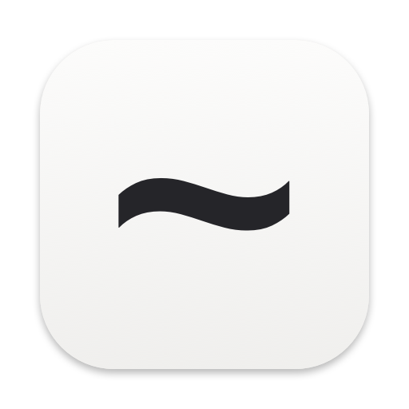

<p align="center">
  <a href="https://github.com/heyeuca/Tilde/releases"></a>
</p>

<h1 align="center">Tilde</h1>

<p align="center">
  <a href="https://github.com/heyeuca/Tilde/actions/workflows/ci.yml"></a>
</p>

*[English](README.md) · [한국어](README.ko.md) · 日本語 · [简体中文](README.zh.md)*

**macOS のための、小さく美しいテキストエディタ。**

> `~` — ホーム、プレーンテキスト、そして必要なものだけ。

---

## Tilde とは？

ソフトウェアの作り方は変わりました。AI 支援の開発が広まり、コードを手で読み書きする機会は大きく減りました。だからこそ、`.txt` や `.md` ファイルをちょっと開くためだけにフル装備の IDE を立ち上げるのは、大げさに感じられます。

Tilde はそのすき間を埋めます。macOS 向けの超軽量テキストエディタで、たった一つの考えを中心に作られています —— ファイルを開き、読み、必要なら一行だけ直して、閉じる。プロジェクトも、ワークスペースも、プラグインも、ターミナルも、サイドバーもありません。

目指すのは、より小さな IDE ではありません。エディタが消え去り、あとには内容だけが残る —— それが目標です。

## コアバリュー

- **即座に (Instant)** — ファイルをダブルクリックすれば、ほぼ瞬時に開きます。
- **静かに (Quiet)** — インターフェースが内容より目立つことはありません。
- **ネイティブ (Native)** — macOS 標準アプリのように振る舞います。
- **美しく (Beautiful)** — テキストを読むこと自体が心地よい体験です。
- **気軽に (Disposable)** — 設定も管理も、ほとんど必要ありません。

## こんな人のために

Tilde は、プレーンテキストファイルをさっと読んだり、軽く編集したりしたい人のためのツールです。

- AI とともに働き、コードエディタで過ごす時間が減った開発者
- Markdown ドキュメントをよく読む人
- 重いエディタを立ち上げずに README・メモ・設定ファイルをちょっと確認したい人

Tilde は IDE でも、プロジェクトワークスペースでも、ノートデータベースでも、Markdown オーサリングツールでも **ありません**。Git 連携、プラグイン、複数ファイルのナビゲーションが必要なら、Tilde は意図的に「適さない」ツールです。

## 機能

- ネイティブな macOS ドキュメントベースアプリ（1 ファイル → 1 ウィンドウ）
- `.txt`・`.md`・`.markdown` ファイルの表示・編集・保存
- ほとんどの UTF ベースのプレーンテキストファイル（`.json`・`.yaml`・`.toml`・`.xml`・`.csv`・`.log`・`.env` など）をプレーンテキストとして開く
- 記法を見せたまま読みやすさを高める、軽量な Markdown スタイリング
- Reader モード（`⌘⇧R`）— Markdown ドキュメントを、表やハイライトされたコードブロックまで完全にレンダリングした読み取り専用ビュー。`#fragment` リンクは文書内を移動し、Web リンクはブラウザで開きます。隣接するローカルファイルを指すリンクや画像は、macOS がファイルアクセスを許可した範囲で動作します —— App Sandbox が文書の隣にあるファイルをブロックすることがあります（ブロックされた画像は代替テキストを表示し、ブロックされたリンクは何も起きません）。Safari の Reader のように、タイトルバーから切り替えられます
- 設定ファイル向けの控えめなシンタックスハイライト: `.json`・`.yaml`・`.toml` のキーだけ色付けし、それ以外はそのまま
- 標準的な編集操作: 取り消し / やり直し、カット / コピー / ペースト、ドラッグ＆ドロップ、スペルチェック、検索と置換
- 折り返し表示（デフォルトでオン）と、オプションの行番号表示
- macOS のセマンティックカラーを用いたライト / ダーク / システム外観
- 高速な起動と、アイドル時のほぼゼロに近いリソース消費
- 完全な macOS 統合: このアプリケーションで開く、ファイルの関連付け、最近使った項目、自動保存、バージョン、フルスクリーン、ウィンドウタブ

### Markdown を、軽やかに

Markdown ファイルには、さりげないセマンティックスタイリングを適用します。見出しの `#` は見えたまま、テキストだけが少し大きく表示されます。`**太字**` は記号を残しつつ、囲まれたテキストを太字で表示できます。狙いは Markdown を隠すことではなく、読みやすくすることです。

スタイルが適用される要素: 見出し、太字、斜体、取り消し線、インラインコード、コードブロック、引用、リンク、箇条書きリスト、番号付きリスト、水平線。

## キーボードショートカット

Tilde は macOS の慣習に従います。

| 操作 | ショートカット |
| --- | --- |
| 新規作成 | `⌘N` |
| 開く | `⌘O` |
| 保存 | `⌘S` |
| 別名で保存 | `⌘⇧S` |
| 閉じる | `⌘W` |
| 検索 | `⌘F` |
| 次を検索 | `⌘G` |
| 前を検索 | `⌘⇧G` |
| 検索と置換 | `⌥⌘F` |
| Reader | `⌘⇧R` |
| 環境設定 | `⌘,` |
| 文字を大きく | `⌘+` |
| 文字を小さく | `⌘-` |
| 文字サイズをリセット | `⌘0` |

## プライバシー

Tilde はすべてのドキュメントをローカルで処理します。

- サーバーへのアップロードなし
- アカウントやサインインなし
- クラウドストレージなし
- AI 機能なし
- 初回リリースでは分析（アナリティクス）なし

## ビルド

Tilde は Swift・SwiftUI・AppKit で作られています。SwiftUI を主要技術とし、成熟したテキストエンジンが必要な箇所では `NSTextView` をラップして使用しています。

必要なもの:

- macOS
- Xcode

ビルドと実行:

```bash
open Tilde.xcodeproj
```

その後、Xcode でビルドして実行します（`⌘R`）。

## Non-Goals（あえてやらないこと）

Tilde は、再びフル装備の IDE に戻ってしまうような要素を意図的に省いています。

- ターミナル、Git、デバッガ、ビルド / 実行、LSP、IntelliSense、リファクタリング、プロジェクトエクスプローラ
- 拡張機能、プラグイン、マーケットプレイス
- ノートデータベース、タグ、バックリンク、Vault、Wiki、同期
- アカウント、コメント、共有ワークスペース、リアルタイムコラボレーション
- AI 補完、チャット、書き換え、エージェント

これらの決定の背景にある製品思想の全体像は [docs/PRODUCT.md](docs/PRODUCT.md) をご覧ください。

## ライセンス

Tilde は [MIT License](LICENSE) の下で配布されています。

---

> **とにかく、ファイルを開こう。**
